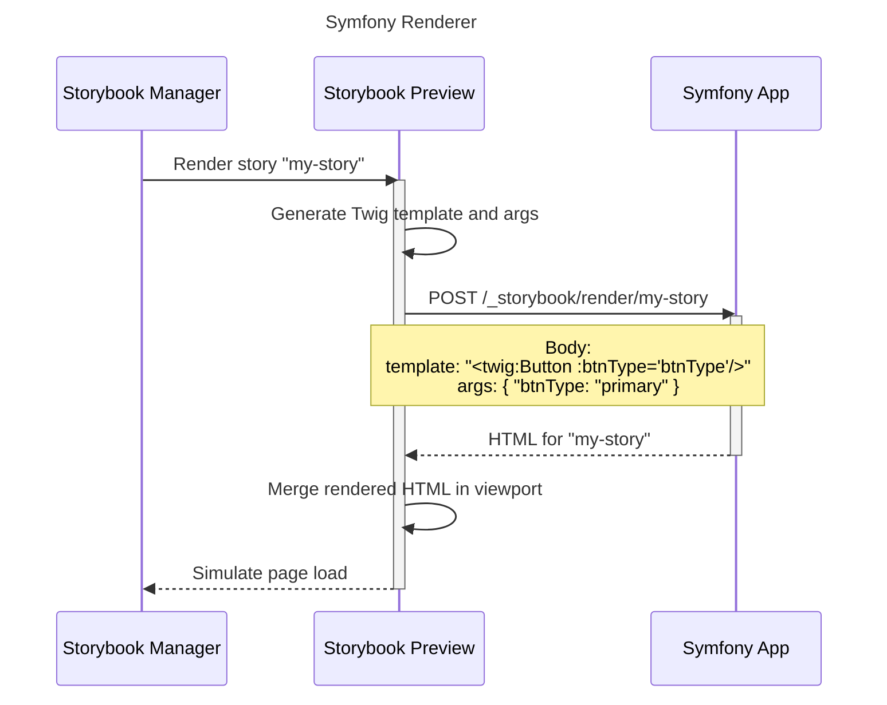

# Configuration

## Twig Rendering

### How It Works

Because Storybook controls the component rendering dynamically from the web application, templates are generated **at runtime** depending on the args, loaders, decorators, etc. Then the template is sent in an HTTP POST request, with a JSON body containing the story template and its args.

To render stories, the bundle configures Twig to use a **dedicated loader and cache**. This way, the main Twig environment is kept unchanged and the bundle features don't interfere with the original application functionalities.




### Twig Sandboxing

Story templates are rendered in a **sandboxed environment**. Because the bundle turns the Symfony application into a remote Twig renderer, it also takes care of what is being asked to render.

The sandbox works exactly like the [built-in Twig sandbox](https://twig.symfony.com/doc/3.x/tags/sandbox.html), except it only applies to the code sent by Storybook, and not to the code owned by the Symfony application.  The latter is considered **trusted**.

By default, the following Twig elements are allowed in stories:

- The `component` function
- The `component` tag
- The `escape` filter

You can configure the sandbox to allow more elements in the bundle configuration:

```yaml
# config/packages/storybook.yaml
storybook:
  sandbox:
    allowedTags:
      - if
    allowedFilters: 
      - length

when@dev:
  storybook:
    sandbox:
      allowedFunctions:
        - dump
```


### The Preview Iframe

When Storybook compiles your stories, it also prepares an HTML document where stories will be rendered. This document is displayed in the Storybook UI with an iframe, and contains all needed materials for Storybook to run its features.

To customize the iframe, you can override the preview template provided by the bundle:

```twig
{# templates/bundles/@StorybookBundle/preview.html.twig #}




    {# render additional tags to <head> #}



    {# render additional tags to <body> #}

```

The rendered content of these blocks will be injected in the preview iframe, similarly to the [previewHead](https://storybook.js.org/docs/configure/story-rendering#adding-to-head) and [previewBody](https://storybook.js.org/docs/configure/story-rendering#adding-to-body) configurations.

## Symfony UX packages

### Live Components

To make [Live Components](https://symfony.com/bundles/ux-live-component/current/index.html) work in Storybook, you have to enable proxy for live component requests in the
Storybook `main.ts|js` configuration:

```ts
// .storybook/main.ts

// ...

const config: StorybookConfig = {
    framework: {
        name: "@sensiolabs/storybook-symfony-webpack5",
        options: {
            // ...
            symfony: {
                proxyPaths: [
                    // ...
                    // 👇 This is the live component route prefix usually set in config/routes/ux_live_component.yaml
                    '_components/',
                ],
            },
        },
    },
};
```

Thanks to this configuration, all requests made by live components to re-render themselves will be sent to the
Symfony application.

### AssetMapper

To use Storybook with a project that uses the [AssetMapper component](https://symfony.com/doc/current/frontend/asset_mapper.html), you need to render your importmap in the preview template:

```twig
{# templates/bundles/@StorybookBundle/preview.html.twig #}




    {{ importmap('app') }}

```

Though, standard HMR will not work properly with AssetMapper. To register additional paths to watch and re-trigger the iframe compilation on change, update your `main.ts|js` configuration:

```ts
// .storybook/main.ts

// ...

const config: StorybookConfig = {
    framework: {
        name: "@sensiolabs/storybook-symfony-webpack5",
        options: {
            // ...
            symfony: {
                // 👇 Add more paths to watch
                additionalWatchPaths: [
                    'assets', // Directories
                    'assets/app.js', // Files
                    'assets/**/*.js' // Glob patterns
                ],
            },
        },
    },
};
```

### StimulusBundle

Stimulus controllers are automatically imported with AssetMapper and the importmap directive. They will be loaded in the preview iframe thanks to the AssetMapper configuration described above.

To enable HMR for Stimulus controllers, ensure they are watched in your `additionalWatchPaths` config key.

### TailwindBundle

If you use [TailwindBundle](https://symfony.com/bundles/TailwindBundle/current/index.html) to manage your CSS, you need to tell Storybook to watch the built CSS file, so the
preview is refreshed with HMR on change:

```ts
// .storybook/main.ts

// ...

const config: StorybookConfig = {
    framework: {
        name: "@sensiolabs/storybook-symfony-webpack5",
        options: {
            // ...
            symfony: {
                additionalWatchPaths: [
                    // ...
                    'var/tailwind/tailwind.built.css'
                ],
            },
        },
    },
};
```

## Configuration Reference

### Storybook Bundle

```yaml
# config/packages/storybook.yaml

storybook:
    # Cache base directory for story rendering.
    # Set false to disable caching. 
    cache: '%kernel.cache_dir%/storybook/twig'

    # Configure the sandbox for Twig rendering.
    sandbox:

        # Functions that are allowed in stories.
        allowedFunctions:     []

        # Tags that are allowed in stories.
        allowedTags:          []

        # Filters that are allowed in stories.
        allowedFilters:       []

        # Properties that are allowed in stories.
        allowedProperties: {}
            # Example:
            # App\MyVariable: ['foo', 'bar'] 
        # Methods that are allowed in stories.
        allowedMethods: {}
          # Example:
          # App\MyVariable: ['someMethod', 'getBaz'] 
```

### Storybook Framework

```ts
// .storybook/main.ts
import type { StorybookConfig } from "@sensiolabs/storybook-symfony-webpack5";

/**
 * Main Storybook configuration.
 */
const config: StorybookConfig = {

    /**
     * Stories specifier.
     * 
     * @see https://storybook.js.org/docs/configure#configure-your-storybook-project
     */
    stories: [
        "../templates/components/**/*.mdx",
        "../templates/components/**/*.stories.[tj]s",
    ],

    /**
     * Addons configuration.
     * 
     * @see https://storybook.js.org/docs/configure#configure-your-storybook-project
     */
    addons: [
        // 👇 This is required for TypeScript config files
        "@storybook/addon-webpack5-compiler-swc",
        // Other addons...
    ],
    
    framework: {
        // 👇 Tell Storybook to use the Symfony framework
        name: "@sensiolabs/storybook-symfony-webpack5",
        options: {
            
            /**
             * Symfony framework options.
             * 
             * These options only applies to the dev environment.
             */
            symfony: {
                /**
                 * Mandatory, the URL of the Symfony development server.
                 * 
                 * @var string
                 */
                server: 'http://localhost',
                
                /**
                 * URLs that should be proxied to the Symfony server.
                 * 
                 * Useful to resolve assets and re-render LiveComponents.
                 * 
                 * @var string[]
                 */
                proxyPaths: [
                    '/assets',
                    '/_components'
                ],

                /**
                 * Additional paths where changes should re-trigger compilation.
                 * 
                 * Use this if your stories depends on modules that are not part 
                 * of the JavaScript compilation (e.g. with AssetMapper and TailwindBundle).
                 * 
                 * @var string[]
                 */
                additionalWatchPaths: [
                    'assets',
                    'var/tailwind/tailwind.built.css'
                ]
            }
        },
    },
};

export default config;
```
