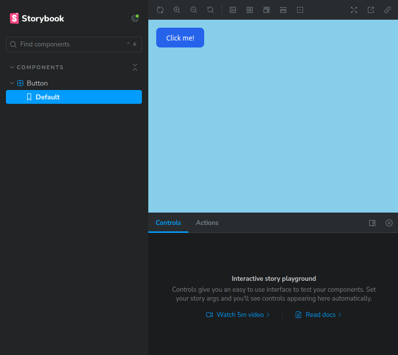
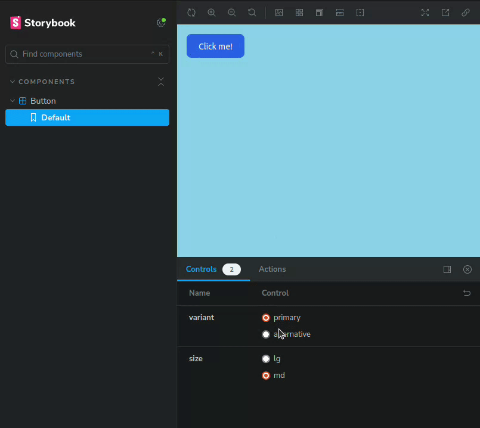
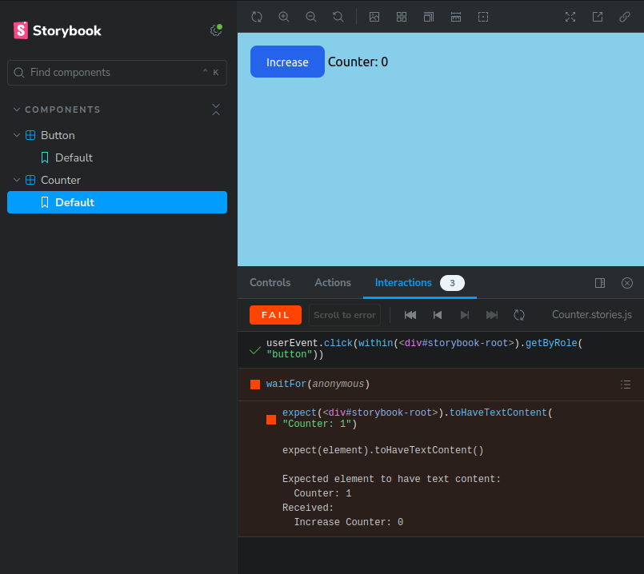
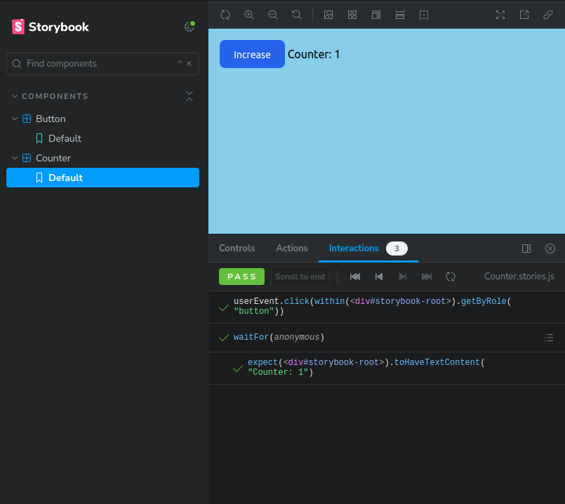
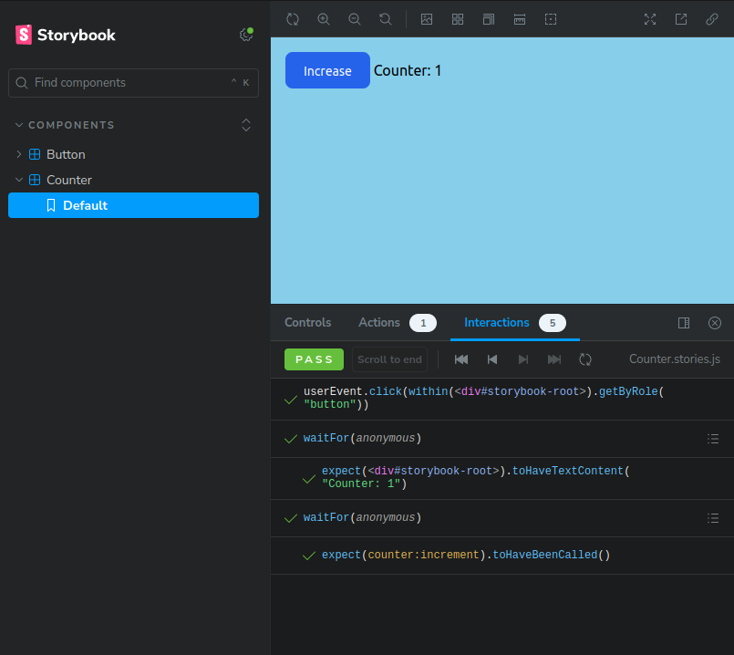
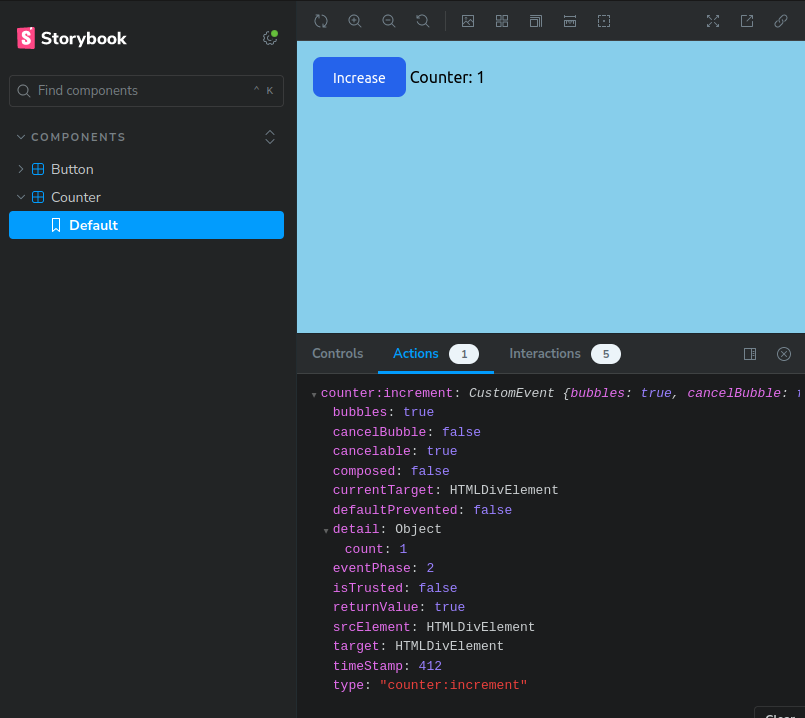

# Getting Started

Once you installed the bundle and its dependencies as described in the [Installation](../README.md#installation) page,
you can start writing your first stories.

We assume you are using Symfony UX packages with the LAST stack architecture and Tailwind.

## Choose stories locations

The first step is to choose where you will write your stories. There are two approaches for this:
1. Put all stories in a dedicated location, like a `stories` directory at the root of your project
2. Put each story next to the component it describes in the `templates/components` directory

It's a matter of choice, regarding if you prefer to keep your template directories dry or not. We'll take the second approach 
here. 

Update your `.storybook/main.ts` configuration file accordingly:

```ts
// .storybook/main.ts

import type { StorybookConfig } from "@sensiolabs/storybook-symfony-webpack5";

const config: StorybookConfig = {
    stories: [
        // 👇 Configure stories specifier here
        "../templates/components/**/*.stories.[tj]s",
    ],
    // ...
};
export default config;
```

## Create your first story

Create an anonymous `Button` component with the following template:

```twig
{# templates/components/Button.html.twig #}



{% set button = cva({
    base: 'focus:ring-4 rounded-lg ',
    variants: {
        variant: {
            primary: 'text-white bg-blue-700 hover:bg-blue-800 focus:ring-blue-300 dark:bg-blue-600 dark:hover:bg-blue-700 focus:outline-none dark:focus:ring-blue-800',
            alternative: 'text-gray-900 focus:outline-none bg-white border border-gray-200 hover:bg-gray-100 hover:text-blue-700 focus:z-10 focus:ring-gray-100 dark:focus:ring-gray-700 dark:bg-gray-800 dark:text-gray-400 dark:border-gray-600 dark:hover:text-white dark:hover:bg-gray-700'
        },
        size: {
            md: 'px-5 py-2.5 text-sm',
            lg: 'px-5 py-3 text-base',
        }
    },
    defaultVariants: {
        variant: 'primary',
        size: 'md',
    }
}) %}

<button type="button" class="{{ button.apply({variant, size}, attributes.render('class')) }}" {{ attributes }}>
    {{ label }}
</button>

```

This component uses the [`cva`](https://symfony.com/bundles/ux-twig-component/current/index.html#component-with-complex-variants-cva) function to handle different variants for size and color.

Then create a story for this component:

```js
// templates/components/Button.stories.js

import Button from './Button.html.twig';

export default {
    component: Button,
}

export const Default = {}
```

Run Storybook:
```shell
npm run storybook
```

And visit http://localhost:6006, then you should see your component:



Great! Let's improve things a little...

Update your story to add some control over your component props: 

```js
// templates/components/Button.stories.js

import Button from './Button.html.twig';

export default {
    component: Button,
}

export const Default = {
    args: {
        variant: 'primary',
        size: 'md',
    },
    argTypes: {
        variant: {
            options: ['primary', 'alternative'],
            control: {type: 'radio'},
        },
        size: {
            options: ['lg', 'md'],
            control: {type: 'radio'},
        },
    }
}
```

Now you can control your component's props from the Storybook UI!



## Interactions and play function

Let's reuse our Button component to create a Counter that increases a value when clicked.

First, install some new packages:

```shell
npm install -D @storybook/test @storybook/addon-interactions 
```

Enable the Interactions addon in the main configuration:
```ts
// .storybook/main.ts

const config: StorybookConfig = {
    addons: [
        "@storybook/addon-webpack5-compiler-swc",
        "@storybook/addon-links",
        "@storybook/addon-essentials",
        // 👇 Register the addon here
        "@storybook/addon-interactions",
    ],
    // ...
};
```

Then restart Storybook.

Now add the Counter template and its Stimulus controller: 

```twig
{# templates/components/Counter.html.twig #}

<div {{ attributes.defaults(stimulus_controller('counter')) }}>
    
        
    

    <twig:Button :label="label" {{ ...stimulus_action('counter', 'increment') }} />
    Counter: <span {{ stimulus_target('counter', 'count') }}>0</span>
</div>
```

```js
// assets/controllers/counter_controller.js

import {Controller} from '@hotwired/stimulus';

export default class extends Controller
{
    static targets = ['count'];

    initialize() {
        this.count = 0;
    }

    countTargetConnected()
    {
        this.countTarget.innerHTML = this.count;
    }

    increment() {
        this.count++;
    }
}
```

Now create a story for this new component and add a play function:

```js
// templates/components/Counter.stories.js

import Counter from './Counter.html.twig';
import { userEvent, within } from '@storybook/test';

export default {
    component: Counter,
}

export const Default = {
    play: async ({ canvasElement}) => {
        const canvas = within(canvasElement);

        const button = canvas.getByRole('button');

        await userEvent.click(button);
    }
}
```

Navigate to the new story in the Storybook UI, and... 


The play function simulated a click on the button. But... The counter still shows 0. That's because our controller didn't update the HTML. It's a bug we could have detected if we had made an assertion about  it:

```js
import {userEvent, waitFor, within, expect} from '@storybook/test';

// ...

export const Default = {
    play: async ({ canvasElement}) => {
        const canvas = within(canvasElement);

        const button = canvas.getByRole('button');

        await userEvent.click(button);
        
        // 👇 Make an assertion about the text in the component
        await waitFor(() => expect(canvasElement).toHaveTextContent('Counter: 1'));
    }
}


```

And, yep, it fails:



Let's fix the bug in `counter_controller.js`:

```js
// assets/controllers/counter_controller.js

export default class extends Controller
{
    // ...

    increment() {
        this.count++;
        // 👇 Update count HTML
        this.countTarget.innerHTML = this.count;
    }
}
```

And go back to Storybook... 



Now the test passes!

## Listen to component events

Now our Counter component works well, but we want other components to be able to react to the increase action.

Update the controller to dispatch an event:

```js
// assets/controllers/counter_controller.js

export default class extends Controller
{
    // ...

    increment() {
        this.count++;
        this.countTarget.innerHTML = this.count;
        // 👇 Dispatch an increment event with count value in payload
        this.dispatch('increment', {detail: {count: this.count}});
    }
}
```

And update the story to add a spy on the `counter:increment` event:

```js
// templates/components/Counter.stories.js

import {userEvent, waitFor, within, expect, fn} from '@storybook/test';

// ...

export const Default = {
    args: {
        'counter:increment': fn() // 👈 Create a spy listener for the event
    },
    play: async ({ args, canvasElement }) => {
        const canvas = within(canvasElement);

        const button = canvas.getByRole('button');

        await userEvent.click(button);

        await waitFor(() => expect(canvasElement).toHaveTextContent('Counter: 1'));
        
        // 👇 Assert that the event has been fired, by asserting the listener has been called 
        await waitFor(() => expect(args['counter:increment']).toHaveBeenCalled());
    }
}
```

Now your play function ensures the event has been dispatched:



And you can grab some details about the event in the Actions panel:



